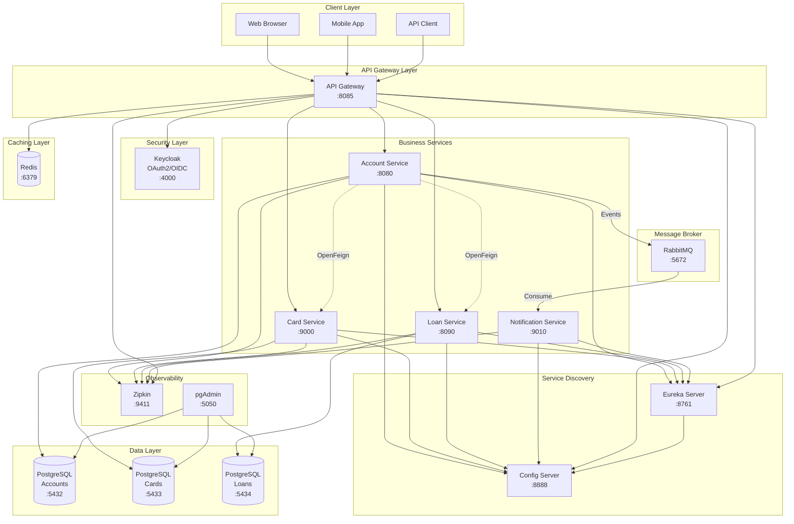
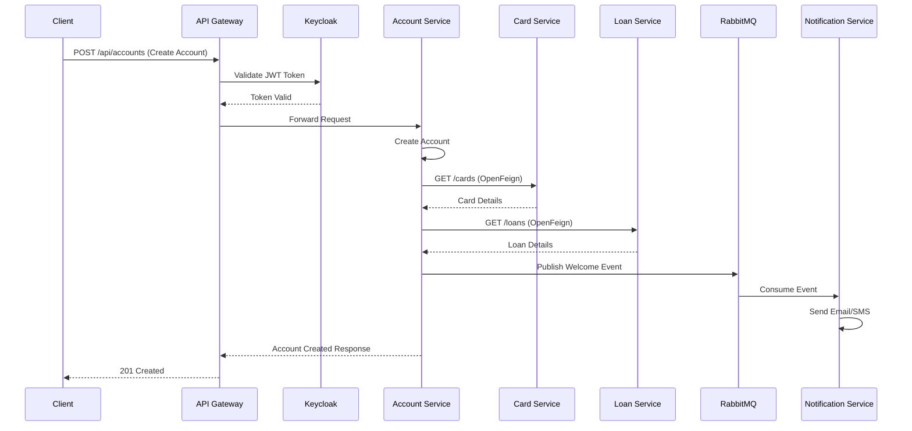
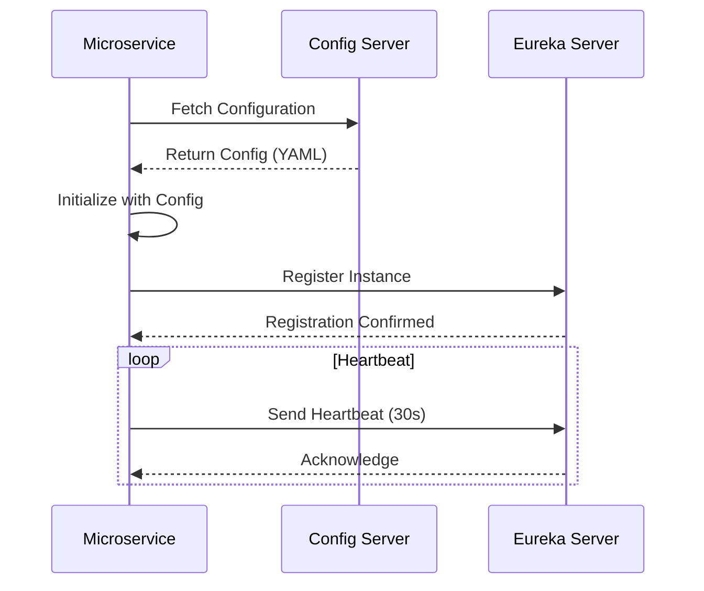
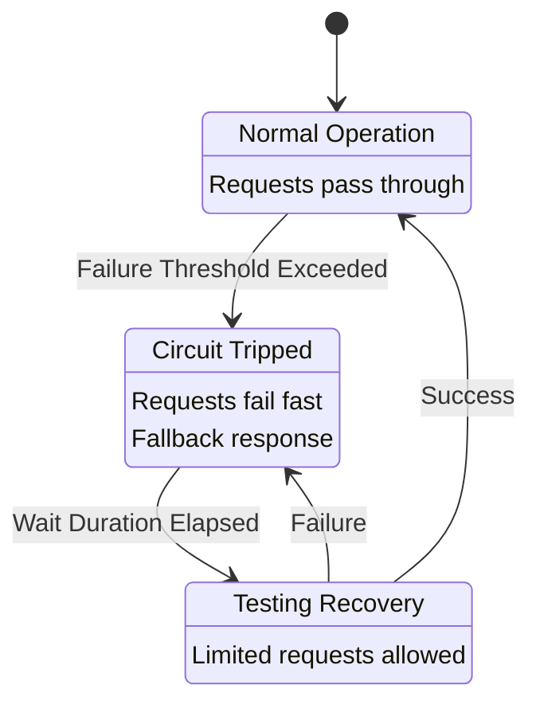
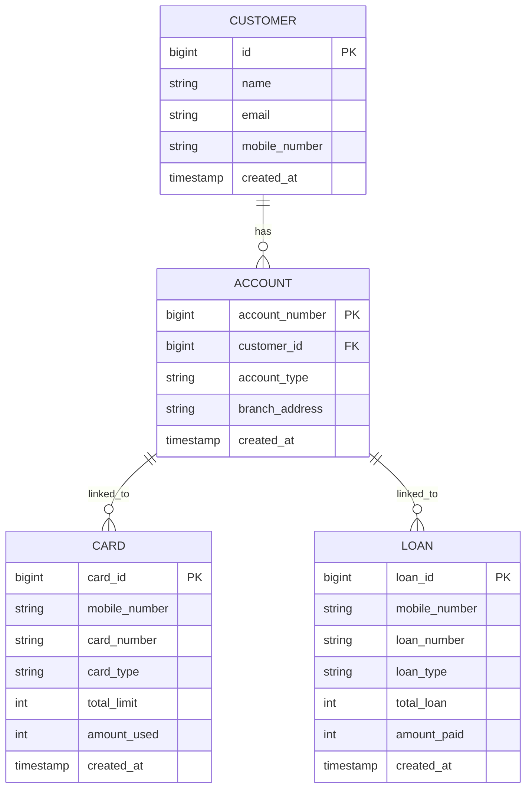
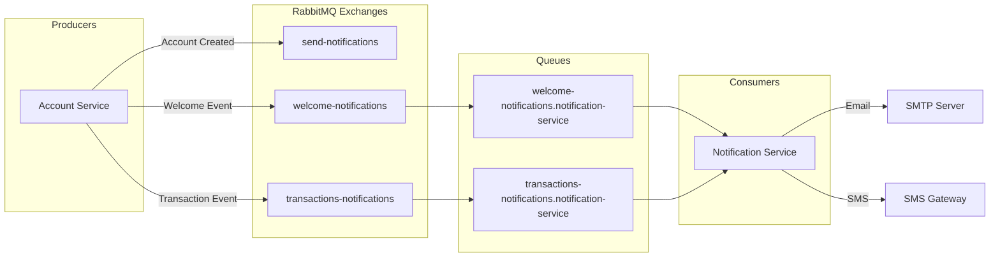
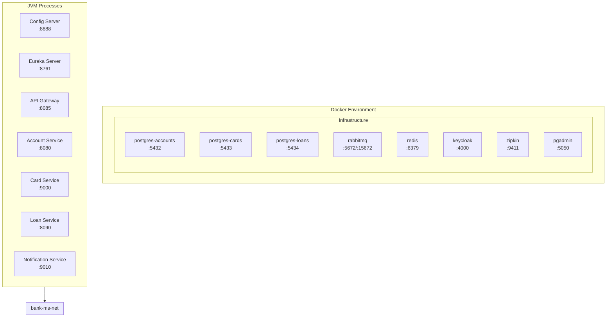
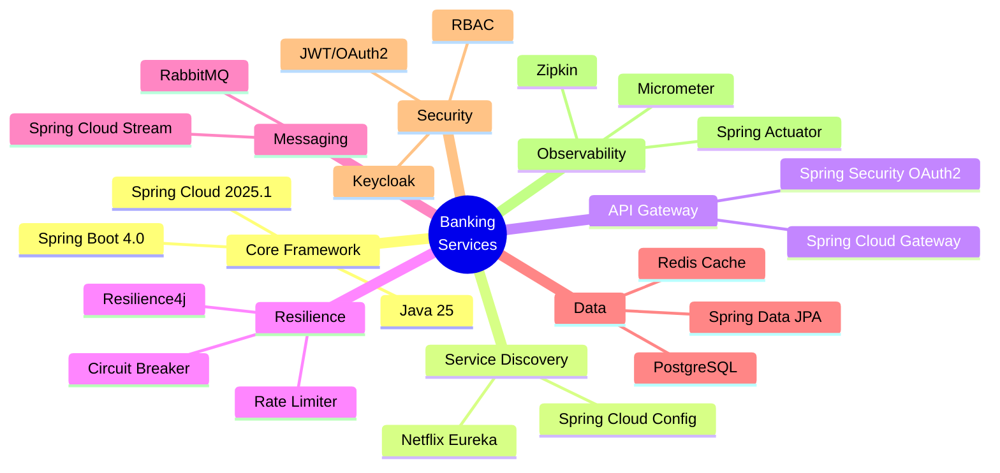

# Banking Services Architecture

## System Architecture Diagram

## Service Communication Flow

## Service Registration Flow

## Circuit Breaker Pattern

## Database Schema Overview

## Event-Driven Architecture

## Deployment Architecture

## Technology Stack

